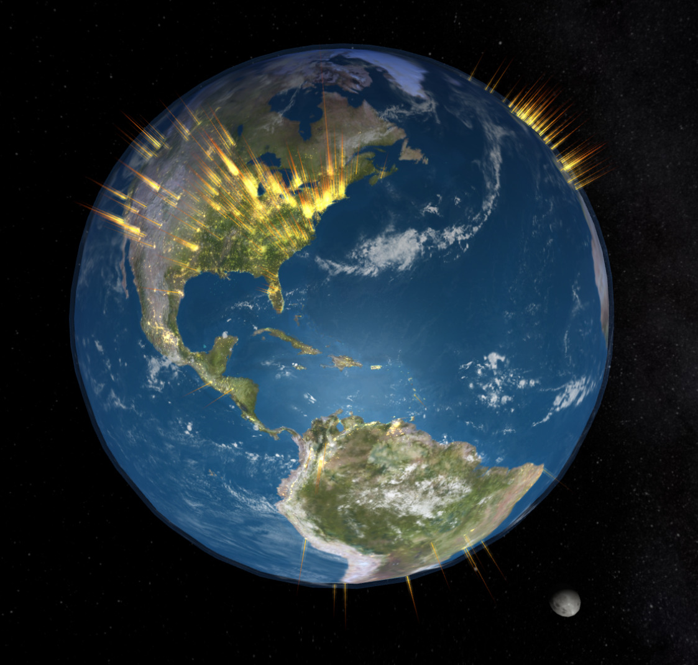
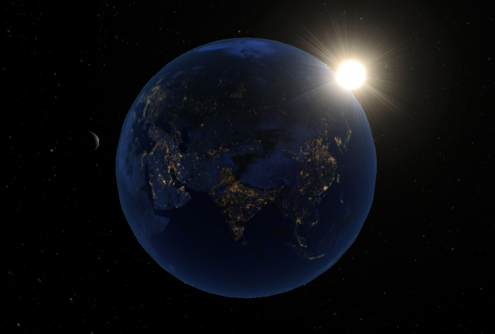
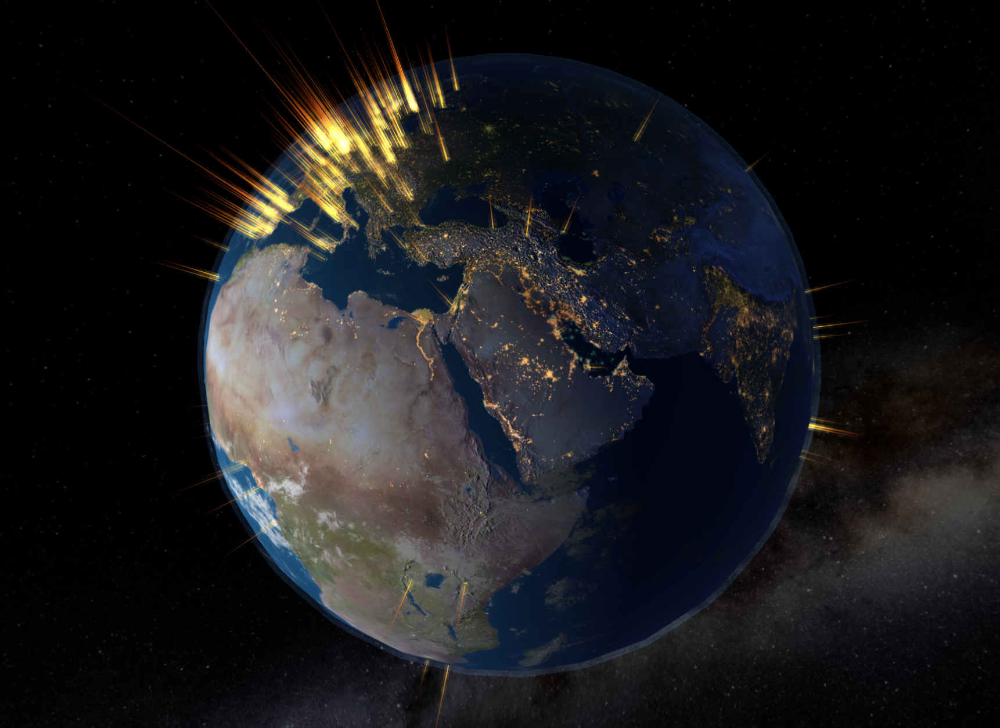
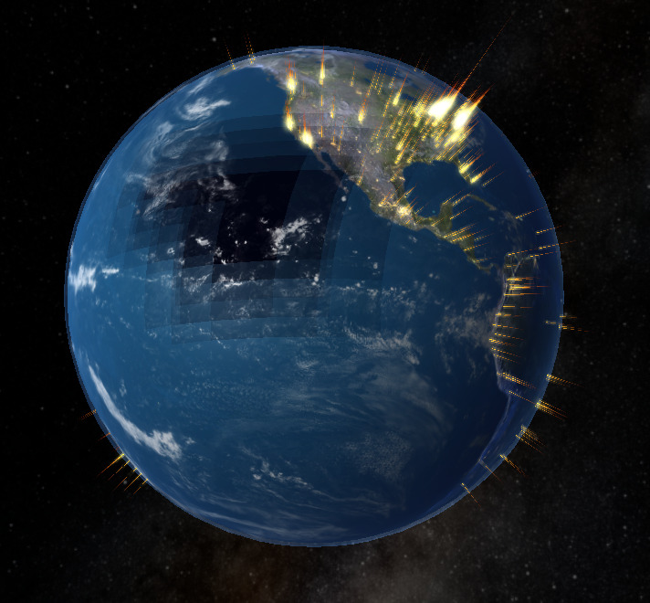

# The Globe Project

"The Globe" has always been the colloquial name of this project. We also referred to it internally as Kahoot! Earth.

## What is this?

This is a from-scratch implementation of a tridimensional Earth globe in Typescript + WebGL. It's meant to be a skeleton project that people can use to display whatever geographical data they want. At Kahoot!, we wanted to use this to display our live kahoot games activity in realtime.

It is a project that's similar in nature to the [Github Globe](https://github.blog/2020-12-21-how-we-built-the-github-globe/) or the [ThreeJS Globe](https://github.com/vasturiano/three-globe) demos.

## Motivation

Why make another one then?

There's a few different reasons, a bit of nostalgia and a lot of perseverance.

Fifteen years ago now, in 2007, I started working at Opera Software in Norway. After a couple of weeks, all engineering employees got together for a few days off-site. One of the first plenary sessions was by a colleague leading the [Opera Mini](https://www.opera.com/browsers/opera-mini) development.

He connected his laptop to the big screen, and showed a terminal window.
After typing the magic incantation:

    pike earth.pike

we were all blown away by this incredible 3D realtime display of the Earth with the live Opera Mini users all over the world.  I don't know how many servers Opera had back then, but in terms of user requests, this was many tens of thousands of requests per second, way beyond what I had ever seen, or imagined a single service could manage.

Being able to see the live activity around the planet was real black magic back then! I've always been fascinated by that project, and what was this *[pike](https://pike.lysator.liu.se/)* thing?

Over time I was able to dig a bit into the project and the people that worked on it and discovered that the pike code was a lightweight wrapper around OpenGL and GLSL shaders. Remember this was 2007; GLSL shaders had been introduced — according to Wikipedia — just in 2004 for the first time!

You can see a video of how this pike Globe looked like. There's a couple of videos on YouTube:

Seeing all of this left a mark in my younger self: I admired the people that built this and I wished one day I could also build something so cool.

The source code for the original pike globe was never released as open source by Opera Software. There has been multiple attempts, both internally at Opera and externally, to get the code released, but it never happened. I am told, that even at Opera there are only a couple of people left, that still know how to run the code and there is a risk that knowledge being lost and of the project being forgotten.

## Screenshots

Here's some screenshots of how this globe looks like when it's rendering live activity.

How the Sun and the Moon look like together (no user activity rendered here):

A screenshot with day and night side of the Earth:

A screenshot with the date of the August 2026 total solar eclipse rendered with the shadow from the Moon:

## How is this Globe built?

This globe is a typescript web application that uses WebGL for the 3D rendering and GLSL shaders for most of the lighting and special effects.

The code is inspired by other similar projects/demos, but we realized we couldn't reach the level of customization and visual effects we wanted by using those existing projects, so we changed direction and built it from scratch using [Three.js](https://threejs.org/) primitives directly.

## How does the Globe render live activity?

Currently, we are running a separate server component that listens to calls to some endpoints on port 5000, and returns a CSV file with longitude, latitude and number of "hits". This represents an aggregate of user activity (but no user information is ever included) anonymized and grouped by location.

This is the part of the project that everyone planning to use this should customize for their particular use case.

In our case, we use Datadog and fetch log data with a Datadog API call, aggregate log records by longitude and latitude, and sort by highest number of hits first, although the sorting is not necessarily needed.

There are some plans for other methods of reporting data, and ideas for serving the data as static files, but essentially this part of the project is probably not the most interesting.

## Are the Sun and Moon in there too?

Yes.

I tried my best to make sure the Sun and the Moon are in their accurate astronomical positions for the date and time of day you are actually seeing them. I can't claim this is 100% accurate yet. I might have made some mistakes. If any errors are there, they will hopefully be corrected in a future update.

During development, I used a few test cases to make sure I did things right, and the Globe can now accurately reproduce vernal equinox conditions, and even the Total Solar Eclipse of August 12, 2026.

The astrodynamics code is based on what mostly everyone else is using for celestial calculations, which is [Jean Meeus' *Astronomical Algorithms*](https://archive.org/details/astronomicalalgorithmsjeanmeeus1991).

In particular, the work of [Keith Burnett](http://www.stargazing.net/kepler/kpb.html) has been the most useful while I was trying to build this. I tried to find current contact information for Keith Burnett but didn't manage to.

## Are you planning to add the ISS to the simulation?

Yes! At least try to.

NASA has [public ephemeris files](https://spotthestation.nasa.gov/trajectory_data.cfm) for the ISS that should be reasonably easy to use to render accurate position and velocity of the ISS in this simulation.

## Licensing Information

Copyright © Kahoot! ASA 2022. All rights reserved.

This project’s source code is licensed under the 3-clause BSD license (see [LICENSE](./LICENSE) file in this distribution or online at [https://opensource.org/licenses/BSD-3-Clause](https://opensource.org/licenses/BSD-3-Clause)).

This project is made possible thanks to the following third-party assets and source code:

* Keith Burnett's sun and moon positions page ([http://www.stargazing.net/kepler/jsmoon.html](http://www.stargazing.net/kepler/jsmoon.html)), that we have converted to Typescript and adapted to be the basis of the `astrodynamics.ts` module. Keith Burnett’s original copyright notice:

    Hacked together by Keith Burnett
    Original location: http://www.xylem.demon.co.uk/kepler/jsmoon.html
    Last modified: 22 February 2000

* Portions of hizzd's Threejs Sun Earth demo source code ([https://github.com/hizzd/threejs-earth-sun/](https://github.com/hizzd/threejs-earth-sun/)) have been used to improve the rendering of the Sun. hizzd’s project is available under the [ISC License](https://en.wikipedia.org/wiki/ISC_license), as per the included metadata in [package.json](https://github.com/hizzd/threejs-earth-sun/blob/master/package.json)

* NASA Earth and Moon publicly available texture assets from https://visibleearth.nasa.gov and https://svs.gsfc.nasa.gov/

## Acknowledgements

I have wanted to build this project for a very long time. I lacked shaders knowledge and realized I needed some help if I really wanted to get this project finished one day.

During the October 2022 internal hackaton at [Kahoot!](https://kahoot.com), a few brave people volunteered to help me, and it's thanks to them that we've finished this. Thank you Mateusz, Carsten and Stefan!

Finally, thanks to [Kahoot!](https://kahoot.com), for allowing us to release this project publicly as open source.

## Dedication

This project is dedicated to the memory of [Per Hedbor](https://blogs.opera.com/news/2016/07/in-memory-opera-pioneer-per-hedbor/), the ex-colleague that, according to my knowledge, was the original developer of the Opera Mini 3D pike globe.

Per sadly passed away in 2016. He was widely regarded as a great programmer, and had a big positive impact at least in my life, even though I haven't worked directly with him that much. I like the thought of this project being dedicated to him and his memory.

## Credits

Made with :sparkling_heart: by:

* [Mateusz](https://github.com/mstaniuk)
* [Carsten](https://github.com/carstenz)
* [Stefan](https://github.com/stefangluszek)
* and myself, [Cosimo](https://github.com/cosimo)
